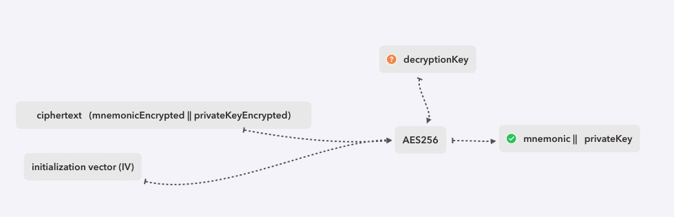
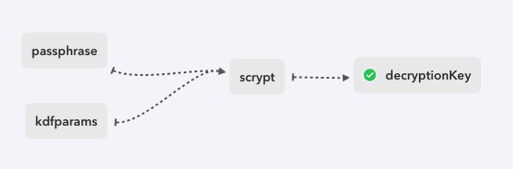
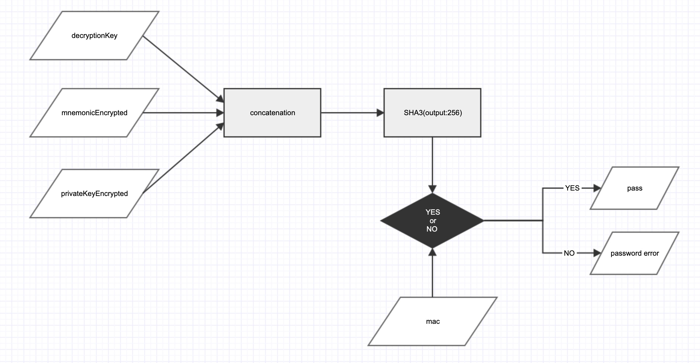
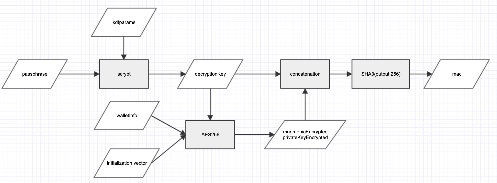
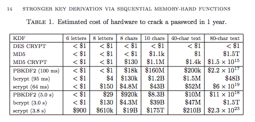
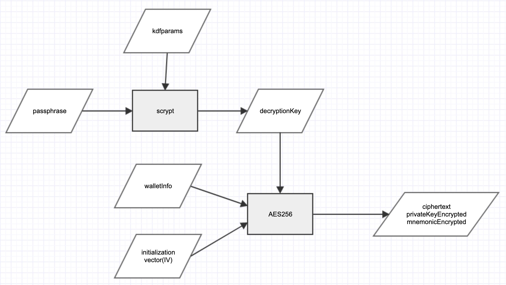

# AELf Key store


## 1. 什么是 AElf Keystore

AElf Keystore 是集成了你的私钥、助记词。并且为你所独有的加密文件。如果你丢失了助记词，私钥。只要你还记得你的账户密码，那么通过 AElf Keystore 你依然可以得到你的助记词或者私钥。同样如果你丢失了AElf Keystore 、私钥、助记词、密码，这也就意味着你的资金被永久的锁定在了你的账户里。

当然你也可以将你的助记词与私钥存储在加密文件中，但是一旦攻击者读取你的文件，那么攻击者可以轻易的获取到你的私钥，并用它签署交易，转走属于你的资金。

## 2. Keystore 文件是什么样的？

```JavaScript
    {
        type: 'aelf',
        nickName: 'Wallet',
        address: '8K4PHZp4xGerftQRN5ufDWnMJMCM4ZzgW4vXoehVkyNknwPGz',
        crypto:
        {
            version: 1,
            cipher: 'AES256',
            cipherparams: { iv: '379986d4d098db8493f05fec60fb00aa' },
            mnemonicEncrypted:
                'U2FsdGVkX19PXP6/te2oE/TWBB4uiplI4ewKbibf+Xq4Rt67B+CYKv2K5klFgyfU200pgG7yo+p1EzsRm8Cr1etoBnw6kNCt5PcdhjVjtmQ/2YU6S93v+ovpQPDh83h/nIgB7P/nGUCAZkvgsbG1GA==',
            privateKeyEncrypted:
                'U2FsdGVkX19PHgwZUU1TqGaC3KA2Btth8RUbiuu0S/ibqqUVJib85Wyg7yJcHEcQVSpLN4/iGCoGKIHm46NMxQFPZdfURjsnzQBxQHDvJikuAGQWP/Lv81JIk4pFv19J',
            kdf: 'scrypt',
            kdfparams:
            {
                r: 1,
                N: 262144,
                p: 8,
                dkLen: 64,
                salt: 'c3c4669a5a3978a75a0201a6516ccba8'
            },
            mac:
                '084f2882107d46aafd5deaa5860187e1b1aaf4f7b6796c72afbc0ea811af1b70'
        }
    };
```

AElf Keystore(之后会直接称之为 Keystore) 包含了用户的一些重要信息, 可以看到在 ```crypto``` 中都是一些可读性差的信息，接下来我们会解释这些参数代表了什么

### 1. Keystore 包含了什么

```type: 'aelf'``` 指Keystore的类型，AELf Keystore 的 type 默认为 'aelf'

```nickName: 'wallet'``` 用户账户名称，可以为 ```null```

```address: 8K4PHZp4xGerftQRN5ufDWnMJMCM4ZzgW4vXoehVkyNknwPGz``` 用户账户地址，可以为 ```null```

#### crypto

```version: 1``` 当前Keystore版本 数值为 ```1``` 则代表是第一版本，在之后的迭代中可能会增加版本，但是你不需要担心，我们会将低版本Api做保留，以保证旧版本Keystore仍然可以导入。

```cipher: 'AES256'```  用于加密AElf私钥与助记词的对称加密算法，此处我们使用AES256加密模式。

```cipherparams: {iv: '379986d4d098db8493f05fec60fb00aa'}```  AES256加密模式所需的初始化向量。

```mnemonicEncrypted``` 助记词密文是 AES256 函数的加密输出

```privateKeyEncrypted```  私钥密文是 AES256 函数的加密输出

```kdf: 'scrypt'``` kdf是一个密钥派生函数，通过你的密码计算解密密钥。AELf Keystore version 1 的密钥派生函数为 scrypt

```kdfparams: ``` 密钥派生函数所需要的参数

#### kdfparams

```r```  块容量参数。 AElf Keystore 默认为 ```1```。

```N```  CPU/内存 消耗参数 必须大于1, 是2的n次幂并且小于2^(128 * r / 8)。 AElf Keystore 默认为 ```262144```。

```p``` 并行化参数，一个小于等于((2^32-1) * hLen) / MFLen的正整数，其中hLen为 32，MFlen是128 * r。（在ltc协议中 p = 1）。AElf Keystore 默认为 ```8```。

```dkLen``` 期望输出的派生密钥的字节长度；一个小于等于(2^32 - 1) * hLen的正整数，其中hLen为32 AElf Keystore 默认为 ```64```。

```salt``` 盐值，一个字节串。

### 2. 解密你的私钥与助记词



想要得到私钥或者助记词，需要通过AES256进行解密， 通过上图所示，Keystore提供了解密的所需要的基本参数。包括初始向量 initialization vector (IV) 与 密文。 但是我们还缺少最重要 decryptionKey ，与之前的加密方式稍显不同，AES256所的解密密钥不在是用户设置的密钥，而是通过KDF派生出的密钥，这里我们则需要通过KDF计算出我们的解密密钥。



通过用户密码与密钥派生函数，我们可以得到 decryptionKey， 这时我们已经有了解密所需的所有参数，便可以得到用户的私钥与助记词。因为密钥派生函数需要通过CPU/内存 进行大量计算，所以破解的成本与时间进一步增高，从而加大破解成本，以保证用户的信息安全。

### 3. 如何确保密码正确

在生成Keystore信息的同时，我们也会基于用户密码生成相对应的mac值，mac值会在导入时判断用户密码是否正确，但是mac值内并不会包含用户真正的密码。mac值通过用户密码经过KDF得到 decryptionKey 生成。出于安全考虑，decryptionKey 并非是完整的。我们截取了第16位至32位进行拼接，防止攻击者得到完整的 decryptionKey。





## 3. 加密与解密

### 加密过程



用户密码 passphrase 是唯一输入，最终会得到助记词密文、私钥密文。即使攻击者得到了Keystore文件，也无法从Keystore文件中得到用户密码的任何信息。scrypt 通过用户密码与kdfparams 生成派生密钥 decryptionKey。decryptionKey 不仅仅用来生成密文，也被用来生成判断密码是否正确的mac值。在解密过程中只有mac只匹配正确才会继续解密密文（mac值通过部分派生密钥与私钥密文、助记词密文相连接并通过SHA3（256）生成）。

decryptionKey 还被用来加密私钥与助记词，密钥或助记词通过 助记词/私钥 + AES256 + 派生密钥 + 初始向量计算出 助记词与私钥的密文。

kdfparams的参数已经预设好。但是需要注意初始向量与盐值是随机生成的。


### 解密过程


可以看出账户密码是你唯一输入，账户信息是唯一输出，所需的其他信息都会在创建AElf Keystore时生成到Keystore内，更改Keystore内任意参数都有可能大致Keystore无法使用。

同时因为账户密码是唯一输入值，所以需要账户密码足够复杂才能保证安全性，AElf Keystore 规定密码需要大于等于12位，并且包含大写字母、小写字母、数字、特殊符号。 才能保证在攻击者得到你的AELf Keystore后也无法轻易的得到你的私钥与助记词信息。 

# 为什么使用 Scrypt

首先我们先了解一下不同的加密方式。

使用单向哈希存储，MD5、SHA1等，由于彩虹表这种攻击方式的存在，MD5与SHA1的安全性是比较差的。

## PBKDF2

PBKDF2 通过 iterations 参数进行 N 次 HMAC运算， HW数据库密码存储的最低安全要求是 1000次 HMAC-SHA256计算，推荐是一万次。

## Bcrypt

BCrypt 相比较PBKDF2 增加了内存IO运算秘籍。但是FPGA已经继承了很大的RAM，解决了内存密集IO的问题。

## Scrypt

Scrypt 弥补了Bcrypt的不足，将CPU计算与内存使用开销提升了一个层级，不仅CPU运算需要指数时间开销，还需要指数内存IO开销。

## 不同加密方式的解密成本（粗略估计）



可以看出，通过scrypt加密的破解成本相比较其他加密方式要高很多。


## 使用 Scrypt 加密方式

Scrypt 相比较 PBKDF2 可以使用更多位数的 salt 与更高的迭代计数，成本因子。 可以使大规模的暴力破解付出更昂贵的成本与更多的时间。



用户密码不再直接用于AES256加密内容，而是通过 scrypt KDF 生成派生密钥哈希值, 然后通过派生密钥对账户信息进行AES256加密, 最终得到密文。


# Resources

- [分组密码工作模式](https://en.wikipedia.org/wiki/Block_cipher_mode_of_operation)

- [密码安全存储](https://www.cnblogs.com/gm-201705/p/9863918.html)

- [initialization vector 初始向量(IV)](https://zh.wikipedia.org/wiki/%E5%88%9D%E5%A7%8B%E5%90%91%E9%87%8F) 

- [Tarsnap Blurb on Scrypt](http://www.tarsnap.com/scrypt.html)

- [Scrypt Whitepaper](http://www.tarsnap.com/scrypt/scrypt.pdf)

- [IETF Scrypt](https://tools.ietf.org/html/draft-josefsson-scrypt-kdf-00)